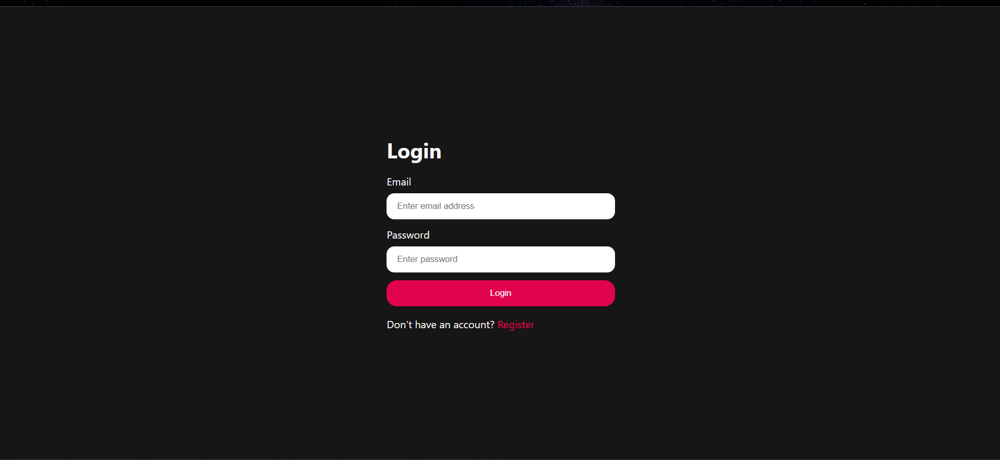
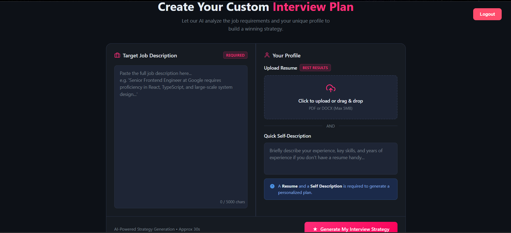
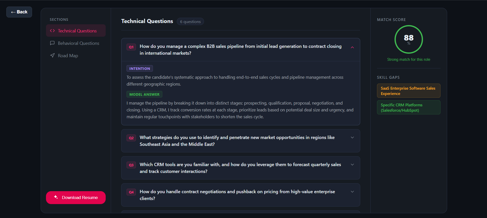
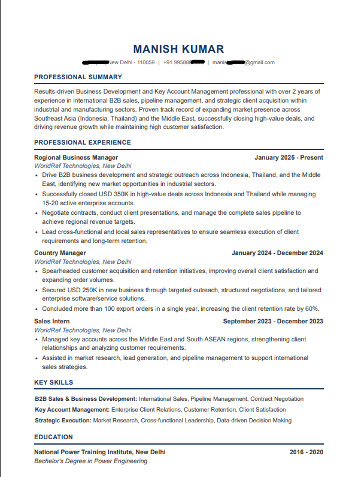

# 🚀 ElevateAI – AI-Powered Interview & Resume Assistant

AI-powered career preparation platform that analyzes your resume and target job description to generate personalized interview questions, identify skill gaps, calculate ATS match scores, and create an ATS-optimized resume using Google Gemini AI.

---

## ✨ Features

- 🤖 AI-powered interview preparation using Gemini AI
- 📄 Upload PDF/DOCX resumes
- 🎯 Analyze target job descriptions
- 📊 Calculate ATS match score
- 🧩 Identify missing skills and knowledge gaps
- 💬 Generate role-specific technical interview questions
- 🗣 Generate behavioral interview questions
- 🛣 Personalized preparation roadmap
- 📑 Generate ATS-friendly resume tailored to the target role
- 🔐 JWT Authentication
- 📁 View previously generated interview plans
- ⚡ Responsive React UI

---
# 📸 Screenshots

## Login

---

## Generate Interview Plan

---

## AI Generated Interview Questions

---

## ATS Optimized Resume

## 🛠 Tech Stack

### Frontend

- React
- Vite
- React Router
- SCSS
- Axios

### Backend

- Node.js
- Express.js
- MongoDB
- Mongoose
- JWT Authentication
- Multer

### AI & Resume Processing

- Google Gemini AI
- Puppeteer
- pdf-parse

### Other

- REST API
- Cookie-based Authentication

## 💡 Highlights

✔ AI-powered resume analysis

✔ Job description matching

✔ ATS score generation

✔ Skill gap analysis

✔ Technical interview question generation

✔ Behavioral interview question generation

✔ Personalized interview roadmap

✔ ATS-optimized resume generation

✔ Secure JWT Authentication

✔ Responsive UI
